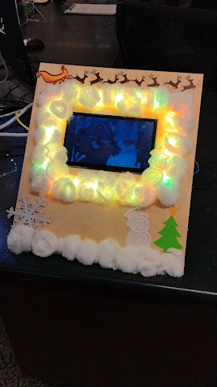
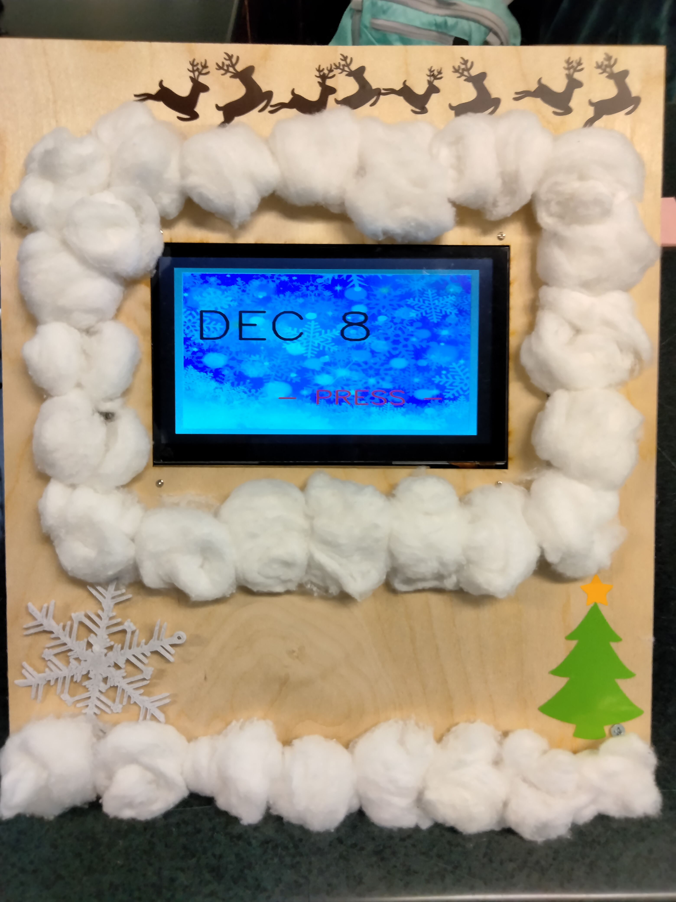
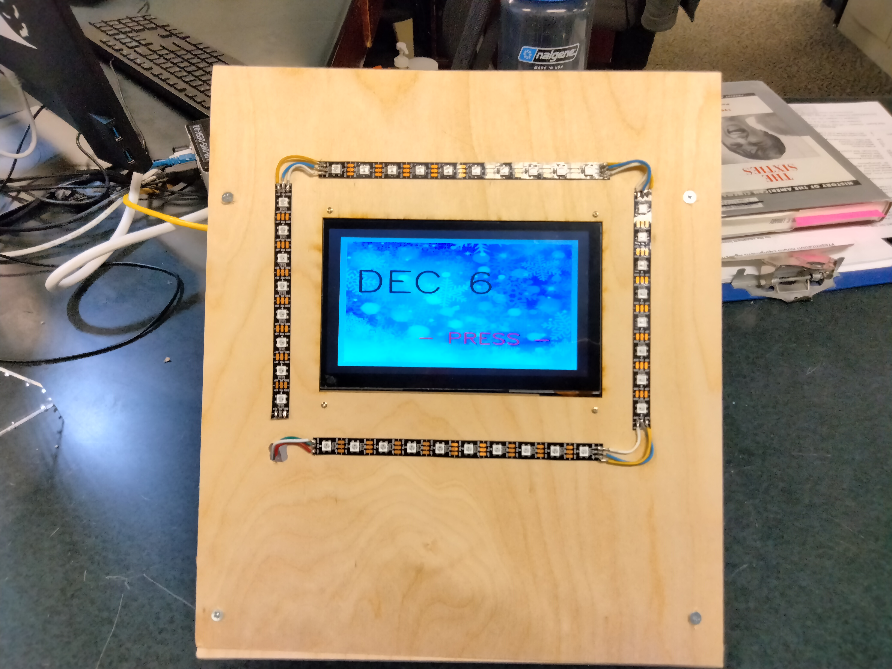
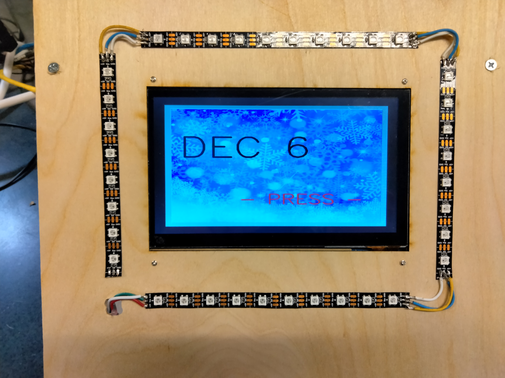
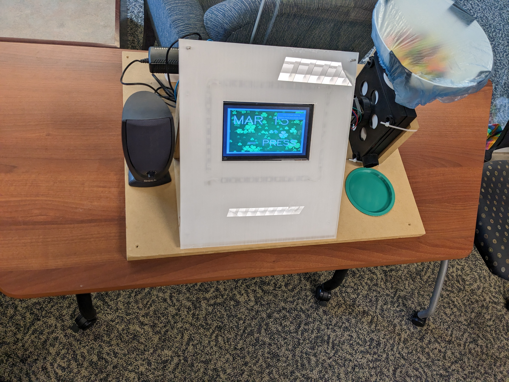

# TreatMachine

<h1>Music Video Calendar and Candy Dispenser</h1>

<h2>By: Matthew Swindall</h2>

  For: MTSU Makerspace
  
  This project was originally developed as a demonstrational exhibit for the MTSU Makerspace for the Winter holiday season and was imagined as a variation on the concept of an Advent calendar. Due to popular demand, the scope of the project was expanded and additional holidays have been included: Valentine's Day, St. Patrick's Day, April Fool's Day, Halloween and Thanksgiving. The finished product is a kiosk style calendar installation on a touch-screen that, on activation, plays short, holiday themed music videos along with an LED light show. The kiosk was decorated by Makerspace student workers with 3D printed ornaments, machine-cut vinyl, and arts supplies for Advent / Christmas. To accomodate additional holidays, a removable polycaarbonate faceplate was created that allows a new et of decorations to be added for each holiday. Video clippings were created using https://www.kapwing.com/video-editor.

Hardware

  <ol>
  <li>Raspberry pi 3 model b v1.2</li>
  <li>7" HDMI LCD touchscreen
  <li>Generic USB speaker</li>
  <li>RGB LED strips</li>
  <li>LAN cable</li>
  <li>HDMI cable</li>
  <li>12V stepper motor</li>
  <li>motor controller</li>
  <li>3D printed candy dispenser (credit to: https://www.thingiverse.com/thing:5030261)</li>
  </ol>
   
  
Software

  <ol>
  <li>advent.py - main control program</li>
  <li>twinkle.py - syncs LED light show to music video</li>
  <li>advent.desktop - allows advent.py to run automatically on startup</li>
  <li>hidemouse.desktop - disables mouse pointer for touchscreen operation</li>
  <li>setup.sh - bash script to install necessary python libraries and adjust raspi-config settings</li>
  <li>treat.py - utilizes GPIO pins to control a stepper motor via a motor contoller (used to operate candy dispenser)</li>
  </ol>
   
    
Additional Materials
    
  <ol>
  <li>Scrap wood</li>
  <li>vinyl</li>
  <li>MDF boards</li>
  <li>PLA filament and 3D printed ornaments</li>
  <li>soldering equipment/tools</li>
  <li>cotton</li>
  <li>Laser cut/etched polycarbonate faceplate</li>
  </ol>
   
    

